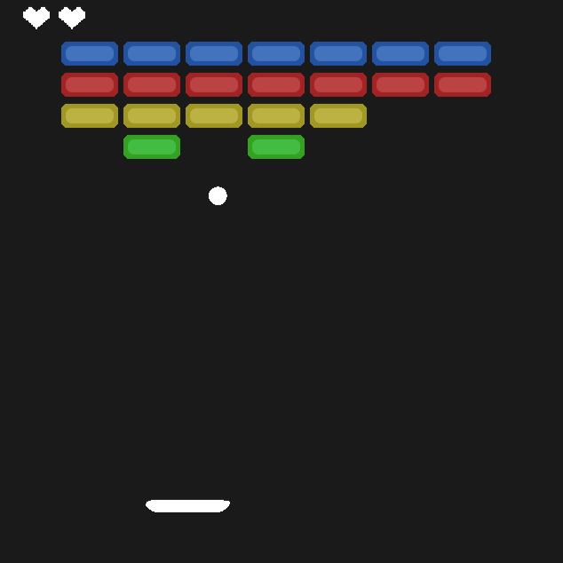

# Breakout Game (Python Turtle)

A simple Breakout game built with Python using the `turtle` graphics module. Smooth controls, bouncing logic, life system, and colorful block visuals.



## Features

- Paddle movement with Left and Right arrow keys
- Start/restart game with Up arrow
- 3 lives (represented by heart icons)
- Realistic bounce depending on where the ball hits the paddle
- Blocks disappear on collision
- Game over message and restart option
- Custom images for paddle, blocks, and hearts

## Controls

- **Left / Right Arrow**: Move paddle
- **Up Arrow**: Start or restart the game

## How to Run

1. Make sure Python 3.x is installed
2. Clone this repository:

```bash
git clone https://github.com/Hesoom/Block-Breaker.git
cd Breakout-Game
```
### Run the game:
```bash
python main.py
```

## File Structure
```
Breakout-Game/
├── img/
│   ├── paddle.gif
│   ├── red.gif
│   ├── blue.gif
│   ├── green.gif
│   ├── yellow.gif
│   ├── heart.gif
│   └── screenshot.png
├── main.py
├── ball.py
├── paddle.py
├── block.py
├── heart.py
└── README.md
```

---
Designed for educational purposes and personal projects.

